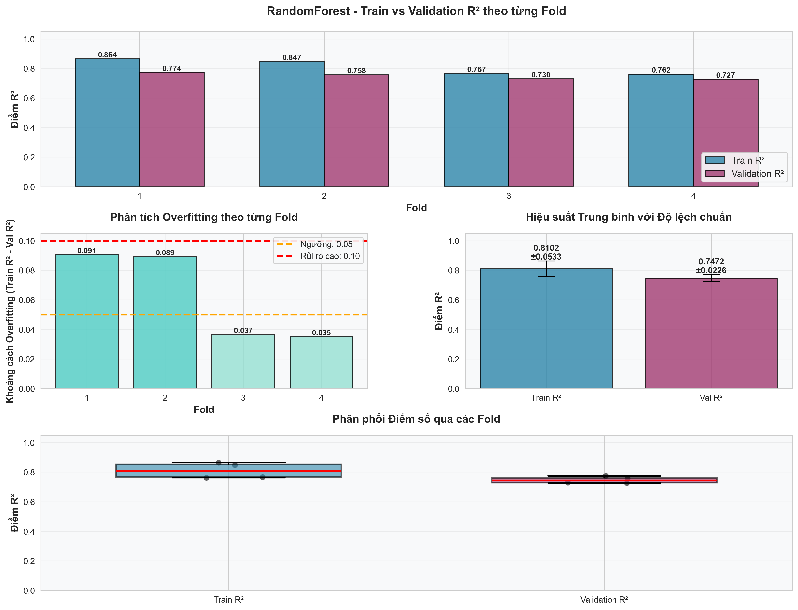
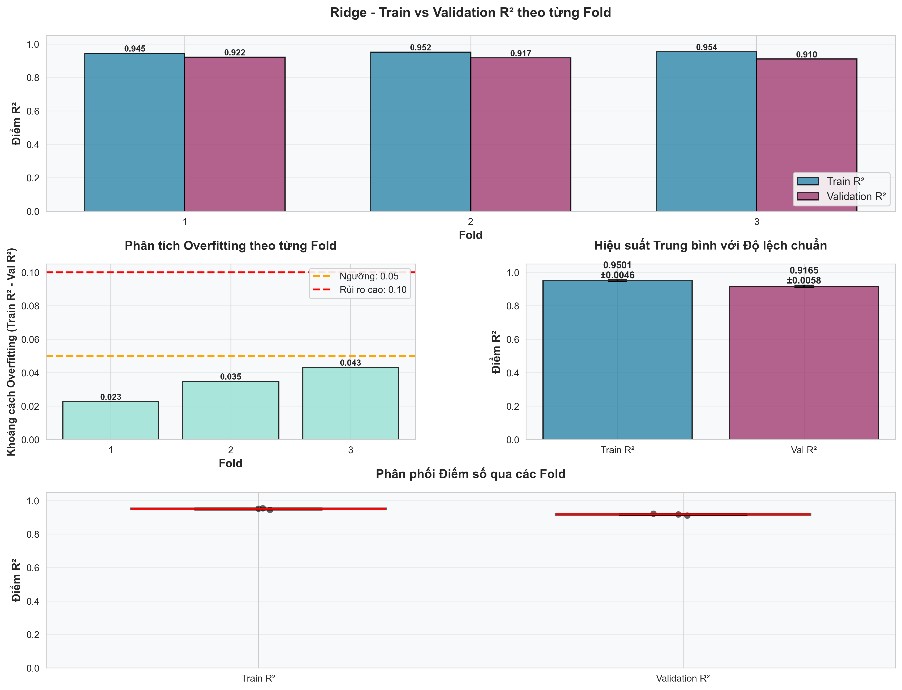

<h1 align="center">MLOps Pipeline for House Price Prediction</h1>

<h3 align="center">
MLOps Pipeline for House Price Prediction là dự án machine learning dự đoán giá nhà, được thiết kế theo hướng End-to-End MLOps với ZenML.
</h3>

---
### **Bài toán**

**Mục tiêu:** Dự đoán giá bán nhà (SalePrice)

**Loại bài toán:** Supervised Learning – Regression

**Dataset:** Ames Housing Dataset

---
### **🎯 Mục tiêu và định hướng xây dựng dự án**
Dự án MLOps Pipeline for House Price Prediction không chỉ nhằm xây dựng một mô hình dự đoán giá nhà có độ chính xác cao, mà còn hướng tới việc mô phỏng toàn bộ vòng đời của một hệ thống Machine Learning trong môi trường thực tế. Trọng tâm của dự án là sự kết hợp giữa các kỹ thuật Machine Learning truyền thống và tư duy MLOps hiện đại, nơi dữ liệu, mô hình và kết quả huấn luyện được quản lý một cách có hệ thống.

Thông qua ZenML, dự án chuẩn hóa quy trình huấn luyện, đánh giá, lưu trữ và lựa chọn mô hình, nhằm đảm bảo tính tái lập, khả năng mở rộng và khả năng sẵn sàng triển khai production. Trong bối cảnh đó, bài toán dự đoán giá nhà đóng vai trò như một case study, còn giá trị cốt lõi nằm ở kiến trúc pipeline và quy trình vận hành ML.

## **🧠 Phương pháp tiếp cận và mô hình hóa**
Bài toán được giải quyết theo hướng Supervised Learning – Regression, với biến mục tiêu là SalePrice. Dữ liệu đầu vào bao gồm nhiều nhóm đặc trưng đa dạng như cấu trúc nhà, chất lượng hoàn thiện, diện tích sử dụng và yếu tố giao dịch. Do dữ liệu có tính phi tuyến cao và số lượng feature lớn sau preprocessing, dự án không giới hạn ở một mô hình đơn lẻ mà áp dụng nhiều thuật toán hồi quy khác nhau.

Ridge Regression được sử dụng làm mô hình baseline nhờ tính ổn định và dễ diễn giải, trong khi Random Forest, XGBoost và LightGBM giúp khai thác các quan hệ phi tuyến phức tạp. Tất cả các mô hình được huấn luyện và đánh giá trong cùng một pipeline nhằm đảm bảo tính nhất quán và so sánh công bằng về hiệu năng.

## **🔗 Ensemble Learning với Stacking Regressor**

Để tận dụng ưu điểm của từng mô hình, dự án áp dụng Stacking Ensemble như một phương pháp nâng cao. Các mô hình hồi quy được huấn luyện song song và kết hợp thông qua một meta model, cho phép mô hình cuối cùng học được cách kết hợp dự đoán hiệu quả hơn so với từng mô hình riêng lẻ.

Quy trình stacking được triển khai bằng K-Fold Cross Validation, trong đó các dự đoán out-of-fold được sử dụng làm đầu vào cho meta model nhằm tránh data leakage. Sau khi hoàn tất stacking, các base models được huấn luyện lại trên toàn bộ tập dữ liệu huấn luyện để tối ưu hiệu năng khi dự đoán dữ liệu mới.

### **Quy trình làm việc của dự án, bao gồm:**

- Tiền xử lý dữ liệu (Data Preprocessing).

- Feature Engineering.

- Huấn luyện & đánh giá mô hình.

- Logging metadata & metrics.

- Quản lý version mô hình (Model Registry).

---

### **📊 Đánh giá mô hình và minh chứng bằng kết quả trực quan**
Hiệu năng của các mô hình được đánh giá bằng R² score và Mean Squared Error (MSE), với toàn bộ kết quả được log tự động vào ZenML Model Registry kèm theo metadata liên quan. Dự án cũng cung cấp các biểu đồ trực quan trong thư mục figures/, thể hiện phân tích chi tiết từng mô hình và so sánh tổng thể giữa các phương pháp.

Kết quả thực nghiệm cho thấy mô hình stacking đạt hiệu năng vượt trội, với `R² = 0.9421` và `MSE = 0.0081`, phản ánh khả năng khái quát tốt và độ chính xác cao trên tập dữ liệu kiểm tra.

### **📊 Phân tích kết quả trực quan**

**I. Phân tích kết quả Cross-Validation – Random Forest Regressor**



**1. Tổng quan thí nghiệm**
- Mô hình: Random Forest Regressor
- Phương pháp đánh giá: 4-Fold Cross-Validation
- Metrics: R² Score, Mean Squared Error (MSE)
- Mục tiêu: Đánh giá mức độ học của mô hình trên tập train, phân tích được khả năng tổng quát hóa trên tập validation. Kiểm tra dấu hiệu overrfiting, đánh giá tính ổn định giữa các fold.

**2. Biểu đồ Train và Validation R² theo từng Fold**

Biểu đồ đầu tiên thể hiện sự so sánh giữa Train R² và Validation R² trên từng fold của quá trình cross-validation. 

**Nhận xét:**
- Ở tất cả các fold, Train R² luôn cao hơn Validation R² 
-> Đây là hiện tượng phổ hiến trong machine learning, cho thấy mô hình học tốt trên dữ liệu huấn luyện nhưng gặp khó khăn khi áp dụng lên dữ liệu chưa thấy trước đó.
- Fold 1 và 2 có sự chênh lệch giữa Train và Validation tương đối lớn.
- Fold 3 và 4 cho thấy train và validation khá gần nhau, chứng tỏ mô hình có khả năng tổng quát hóa tốt hơn trên các fold này.

**Ý Nghĩa**
Điều này cho thấy mô hình có xu hướng học rất tốt trên dữ liệu được huấn luyện. Khả năng tổng quát hóa ổn định hơn ở các fold sau, nơi dữu liệu được chia hợp lý hơn.

**3. Phân tích Overfiting theo từng Fold**

Overfiting được đo bằng hiệu số giữa Train R² và Validation R² trên từng fold.

**Ngưỡng đánh giá:**

- 0.05: bắt đầu cần chú ý
- 0.1: có dấu hiệu overfiting

**Nhận xét theo từng fold:**
- Fold 1 và Foild 2: khoảng cách train và validation khá lớn, dẫn đến việc có dấu hiệu overfiting.
- Fold 3 và Fold 4: khoảng cách nhỏ, mô hình có khả năng tổng quát hóa tốt hơn.

**Kết luận:**
Random Forest không bị overfiting nghiêm trọng, tuy nhiên một vài fold ban đầu cho thấy mô hình học hơi quá chi tiết trên tập train. Điều này có thể chấp nhân được và thường gặp trong các mô hình ensemble.

**4. Hiệu suất trung bình và độ lệch chuẩn**
Biểu đồ tiếp theo thể hiện giá trị R² trung bình kèm độ lệch chuẩn trên toàn bộ các fold.

**KẾT QUẢ:**
- Train R² trung bình: `0.8102 ± 0.0533`
- Validation R² trung bình: `0.7472 ± 0.0226`

Phân tích
- Validation R² đạt mức tương đối cao -> Mô hình có khả năng tổng quát hóa tốt.
- Độ lệch chuẩn thấp trên validation R² -> Mô hình hoạt động ổn định giữa các fold.
- Sự chênh lệch giữa Train và Validation là hợp lý, không quá lớn.

**5. Phân phối điểm số qua các Fold**

Biểu đồ boxplot cho thấy phân phối điểm số R² của Train và Validation qua các fold.

**Nhận xét:**
- Train R² có độ phân tán lớn hơn -> phụ thuộc nhiều vào cách chia dữ liệu
- Validation R² tập trung và ổn định hơn -> khả năng tổng quát hóa tốt. 
- Không xuất hiện outlier nghiêm trọng. 

**Ý nghĩa:**
Điều này cho thấy mô hình không quá nhạy cảm với việc chia dữ liệu và có hiệu suất nhất quán trên các tập validation khác nhau.

**6. Kết luận chung**

Radom forest regressor thể hiện hiệu suất tốt với khả năng tổng quát hóa ổn định qua các fold. Mặc dù có dấu hiệu overfiting nhẹ ở một số fold, nhưng nhìn chung mô hình hoạt động hiệu quả và đáng tin cậy cho bài toán dự đoán giá nhà.

**II. Phân tích kết quả Cross-Validation – Ridge Regressor**

Phần này trình bày kết quả đánh giá mô hình Ridge Regression thông qua K-Fold Cross-Validation (K = ) với thước đo R², tập trung vào khả năng tổng quát hóa, mức độ overfitting và độ ổn định của mô hình.



**1. Tổng quan thí nghiệm**
- Mô hình: Ridge Regression
- Loại mô hình: Linear model + L2 regularization
- Phương pháp đánh giá: 3-Fold Cross-Validation
- Metric: R² score
- Mục tiêu: Đánh giá hiệu suất train và validation, kiểm tra overfiting, phân tích độ ổn định giữa các fold.

**2. Biểu đồ Train và Validation R² theo từng Fold**

Biểu đồ đầu tiên thể hiện điểm Train R² và Validation R² của Ridge Regression trên từng fold.

**Quan sát chính:**
|Fold|Train R²|Validation R²|
|-|-|-|
| **Fold 1**|0.945|0.922|
| **Fold 2**|0.952|0.917|
| **Fold 3**|0.954|0.910|

**Nhận xét**
- Cả Train và Validation R² đều rất cao (>0.9) trên tất cả các fold, cho thấy mô hình học tốt và tổng quát hóa hiệu quả.
- Validation R² hơi giảm nhẹ ở fold 3 nhưng vẫn duy trì ở mức cao.

**Ý nghĩa**
Điều này cho thấy Ridge Regression có khả năng nắm bắt mối quan hệ giữa các đặc trưng và biến mục tiêu một cách hiệu quả, đồng thời tránh được overfiting nhờ regularization.

**3. Phân tích Overfitting theo từng Fold**

Kết quả của từng fold cho thấy sự chênh lệch rất nhỏ giữa Train R² và Validation R².

**Kết luận:** Ridge hầu như không bị overfiting trên bất kỳ fold nào. Regularization L2 phát huy vai trò kiểm soát độ phức tạp mô hình, giúp duy trì hiệu suất ổn định.

**4. Hiệu suất trung bình và độ lệch chuẩn**

Biểu đồ thể hiện giá trị R² trung bình và độ lệch chuẩn trên các fold.

**Kết quả**

- Train R²: `0.9501 ± 0.0046`
- Validation R²: `0.9165 ± 0.0058`

**Phân tích**

- Validation R² rất cao → mô hình dự đoán chính xác.
- Độ lệch chuẩn rất nhỏ → kết quả ổn định giữa các fold.
- Chênh lệch Train–Validation thấp → mô hình tổng quát tốt.

**5. Phân phối điểm số qua các Fold (Boxplot)**

Boxplot cho thấy phân phối điểm R² của Train và Validation.

**Nhận xét:** Các điểm R² tập trung cao, không có outlier. Biên độ dao động cực nhỏ. 

**Ý nghĩa:** Mô hình Ridge Regression rất ổn định, không bị ảnh hưởng nhiều bởi cách chia dữ liệu.

**6. Kết luận chung**

**Ridge Regression** đạt hiệu suất rất cao trên cả train và validation.Không có dấu hiệu overfitting đáng kể.


### **Thiết lập môi trường ảo cho Python**
**Bước 1**: Tạo môi trường ảo (venv)
```
python -m venv venv
```
**Bước 2**: Vào venv 
```
venv/Scripts/activate
```
**Bước 3**: Tạo file requirement.txt.

**Bước 4**: Tải các thư viện của file requirement.txt cấu hình thư viện cho dự án
```
pip install -r requirements.txt
```
***Lưu ý***: Nếu bạn muốn mở rộng dự án thì sau khi pip install 1 thư viện bất kì ngoài các thư viện đã có sẵn trong file `requirements.txt` thì thêm các thư viện được cài thêm vào file `requirements.txt` như sau:
```
pip freeze > requirements.txt
```
**Bước 5**: Khởi tạo ZenML
```
zenml init
```
**Bước 6**: Chạy ZenML local
```
zenml login --local --blocking
```
**Bước 7**: Chạy dự án
```
python run_pipeline.py
```
**Bước 8:** Chạy app Stremlit để kiểm tra mô hình
```
python -m streamlit run app/app.py
```
**Bước 9:** Xem logs và kết quả trong ZenML Dashboard
```
zenml model list
```

**KẾT QUẢ NHẬN ĐƯỢC**
- Logs của dự án từ đầu tới cuối.
- Các metrics(MSE, R2) được dưới dưới dạng database trong ZenML Model Registry.
- Mô hình được quản lý qua các lệnh CLI.

---

#### **THÔNG TIN DỰ ÁN**

Dự án sử dụng tập dữ liệu chuẩn về dự đoán giá nhà là : `AmesHousing`

**1. Tổng quan Dataset**
Dataset AmesHousing là bộ dữu liệu về nhà ở tại thành phố Ames, Lowa(Mỹ) là một dataset thay thế chất lượng cao cho Boston Housing trong các bài toán dự đoán giá nhà.

***Mục tiêu***: Dự đoán giá nhà dựa trên các đặc trưng về cấu trúc nhà, tiện ích, chất lượng, vị trí,...

**2. Thông tin dữ liệu của `AmesHousing.csv`**

***Số lượng:***
- Số dòng(bảng ghi): 2931 dòng
- Số cột(biến): 82 cột (bao gồm cả biến target: salePrice)

**3. Mô tả biến và nhóm cột**

***Nhóm 1: Tiện nghi/hệ thống kỹ thuật trong nhà***

Các cột nói về tiện nghi, điều hòa
|Name|Describle|
|-|-|
| **Central Air**| Có điều hòa giữa nhà hay không (Y/N)|
| **Electrical** | Hệ thống điện chính(Ví du: SBrkr, FuseA)|
| **Functional**|Tình trạng chức năng tổng thể của nhà|
| **Paved Drive**| Lối xe vào (driveway) có được lát nhựa/bê tổng không|

---
***Nhóm 2: Diện tích và không gian sử dụng***

Các cột diện tích mặt sàn và không gian sống

|Name|Describle|
|-|-|
| **1st Flr SF**|Diện tích sàn tầng 1(square feet)|
| **2nd Flr SF**|Diện tích sàn tầng 2|
| **Low Qual Fin SF**|Diện tích sàn hoàn thiện chất lượng thấp|
| **Gr Liv Area**|Diện tích sử dụng trên mặt đất không tính tầng hầm|
| **Wood Deck SF**|Diện tích sàn gỗ(desk)|
| **Open Porch SF** |Diện tích hiên mở|
| **Enclosed Porch**|Diện tích hiên kín|
| **3Ssn Porch**|Diện tích hiên 3 mùa|
| **Screen Porch**|Diện tích hiên có lưới chắn|
| **Pool Area**|Diện tích hồ bơi|
| **Garage Area**|Diện tích gara|

---

***Nhóm 3: Phòng/Bố cục bên trong***

Các cột về số lượng phòng

|Name|Describle|
|-|-|
| **Bsmt Full Bath**|Số phòng tắm đầy đủ ở tầng hầm|
| **Bsmt Half Bath**|Số phòng tắm nửa ở tầng hầm|
| **Full Bath**|Số phòng tắm đầy đủ trên mặt đất|
| **Half Bath**|Số phòng tắm nửa (toilet, không đủ tiện nghi tắm)|
| **Bedroom AbvGr**|Số phòng ngủ trên mặt đất|
| **Kitchen AbvGr** |Số bếp trên mặt đất|
| **TotRms AbvGrd**|Tổng số phòng trên mặt đất (không tính phòng tắm)|
| **Fireplaces**|Số lò sưởi|
| **Garage Cars**|Sức chứa gara tính theo số xe|

---

***Nhóm 4: Chất lượng và tình trạng hoàn thiện***

Các cột mang tính đánh giá chất lượng

|Name|Describle|
|-|-|
| **Kitchen Qual**|Chất lượng bếp|
| **Fireplace Qu**|Chất lượng lò sưởi|
| **Garage Qual**| Chất lượng gara|
| **Garage Cond**|Tình trạng gara (condition)|
| **Pool QC**|Chất lượng hồ bơi|
| **Fence** |Loại hàng rào|
| **Misc Feature**|Đặc điểm phụ thêm (shed, elevator, …)|

---

***Nhóm 5: Thông tin gara***

|Name|Describle|
|-|-|
| **Garage Type**|Loại gara|
| **Garage Yr Blt**| Năm xây gara|
| **Garage Finish**| Mức độ hoàn thiện nội thất gara|
| **Garage Cars**|Sức chứa |
| **Garage Area**|Diện tích|
| **Garage Qual** |Chất lượng|
| **Garage Cond**|Tình trạng|

---

***Nhóm 6: Tiện nghi bên ngoài/Ngoại thất***

|Name|Describle|
|-|-|
| **Misc Feature**|Các tiện nghi khác |
| **Misc Val**|Giá trị ước tính của tiện ích phụ|
| **Các thuộc tính đã có**| Oử trên|

---

***Nhóm 7: Thông tin gara***

Các cột về thời điểm bán và loại giao dịch:
|Name|Describle|
|-|-|
| **Mo Sold**|Tháng bán|
| **Yr Sold**|Năm bán|
| **Sale Type**|Loại giao dịch|
| **Sale Condition**|Tình trạng giao dịch|

---

***Nhóm 8: Target***

`SalePrice:` Giá bán ngôi nhà (biến mục tiêu khi làm mô hình dự đoán).

---

### **Kiến Trúc MLOps PipeLine**
---
Pipeline được xây dựng bằng ZenML, gồm các bước chính:

1. Data ingestion -> Load và validate dataset.
2. Data Cleaning -> Xử lý missing value.
3. Feature Engineering -> Engcoding, log, Scale.
4. Outlier Handling – Loại bỏ giá trị bất thường (IQR, ZScores).
5. Train/Test Split.
6. Model Training – Huấn luyện mô hình hồi quy.
7. Model Evaluation – Đánh giá bằng MSE & R².
8. Model Registry – Lưu metadata & quản lý version.
---
**ĐÁNH GIÁ CHẤT LƯỢNG MÔ HÌNH**
-
***Các chỉ số được log vào metadata của ZenML:***
- R² score

- Mean Squared Error (MSE)

- Số lượng feature sau preprocessing

- Số mẫu test

***Kết quả mô hình tốt nhất:***
- R² ≈ 0.9421

- MSE ≈ 0.0081

- Số feature sau xử lý: 278
### **Hướng phát triển**
---
Deploy mô hình production bằng MLflow Model Serving

Theo dõi model performance & data drift

Container hóa pipeline với Docker

---
### **Công nghệ sử dụng**

Language: Python.

MLOps: ZenML, Model Registry, Model Versioning.

Machine Learning: Scikit-learn, Regression, Feature Engineering.

Data: Pandas, NumPy.

Tools: Git (Version Control).

---
**LIÊN HỆ**
---
Cảm ơn bạn đã ghé thăm dự án của tôi❤️

Nếu bạn muốn kết nối, đừng ngần ngại liên hệ với tôi nhé!

📧 Email: ndtoan.work@gmail.com

💼 LinkedIn: https://www.linkedin.com/in/ndtoanwork/

📍 Địa điểm: Bình Thạnh, TP. Hồ Chí Minh, Việt Nam
